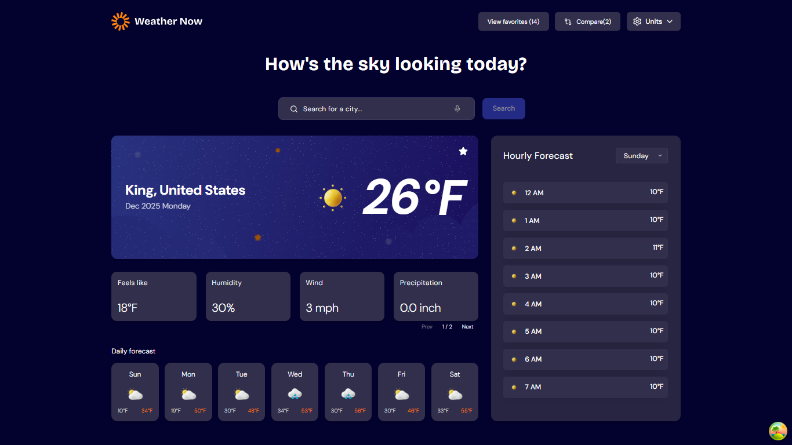

# 🌦️ Weather App

## Installation

Follow these steps to run the project locally:

```bash
# Clone the repository
git clone https://github.com/SpartanFranco/weather-app.git

# Navigate into the project directory
cd weather-app

# Install dependencies (elige tu gestor)
# npm
npm install
# pnpm
pnpm install
# yarn
yarn install
# bun
bun install

# Start the development server
# npm
npm run dev
# pnpm
pnpm dev
# yarn
yarn dev
# bun
bun run dev
```

The application will be available at:

```bash
http://localhost:5173
```

---

## Preview



> _Main screen displaying current weather conditions, weekly forecast, and hourly forecast._

---

## Project Overview

**Weather App** is a modern, responsive web application that allows users to check real-time weather information and future forecasts for any location worldwide. The app is designed with a strong focus on user experience, accessibility, and clean visual presentation, adapting seamlessly to different screen sizes and devices.

Weather data is powered by the **Open-Meteo API**, providing accurate and up-to-date meteorological information without complex authentication requirements.

---

## Core Features

### 🔍 Location Search

- Search for weather information by entering a city or location in the search bar.
- Automatic **geolocation detection** to display weather data for the user’s current location on first visit.

### 🌡️ Current Weather Conditions

- Current temperature.
- Weather condition icon.
- Location name and details.
- Additional metrics:
  - _Feels like_ temperature
  - Humidity percentage
  - Wind speed
  - Precipitation amount

### 📆 7-Day Forecast

- Weekly weather forecast.
- Daily high and low temperatures.
- Weather icons for each day.

### ⏰ Hourly Forecast

- Hour-by-hour temperature changes.
- Day selector to switch between different days of the week.

### 🔁 Units & Preferences

- Toggle between **Metric** and **Imperial** systems.
- Switch temperature units between **Celsius (°C)** and **Fahrenheit (°F)**.
- Select wind speed units (**km/h** or **mph**).
- Precipitation displayed in millimeters.

### ⭐ Favorites & Comparison

- Save favorite locations for quick access.
- **Compare Locations** feature to view weather data side-by-side for multiple cities.

### 🌞 Advanced Weather Data

- UV Index
- Visibility
- Air pressure

### 🎤 Voice Search

- Search for locations using **voice input** for a faster and more accessible experience.

### 📱 Responsive Design & Accessibility

- Fully responsive layout optimized for mobile, tablet, and desktop devices.
- Hover and focus states for all interactive elements to improve usability and accessibility.

---

## Technologies Used

- **Framework:** React 19 + TypeScript + Vite 7
- **Styling:** Tailwind CSS 4, HeroUI (components)
- **State and Data Management:** TanStack Query 5, Zustand
- **Routing:** React Router 7
- **Animations and Icons:** Framer Motion, Lucide Icons
- **HTTP and APIs:** Axios, Open-Meteo (weather data)
- **Browser Features:** Geolocation API, Web Speech API (voice search)
- **Quality:** ESLint, Prettier, React Compiler (Babel plugin)

---

## License

This project is licensed under the MIT License. You are free to use, modify, and distribute it.

---

## Author

Developed by **Geovani Franco** 🚀

If you find this project useful, feel free to give it a ⭐ on GitHub.
